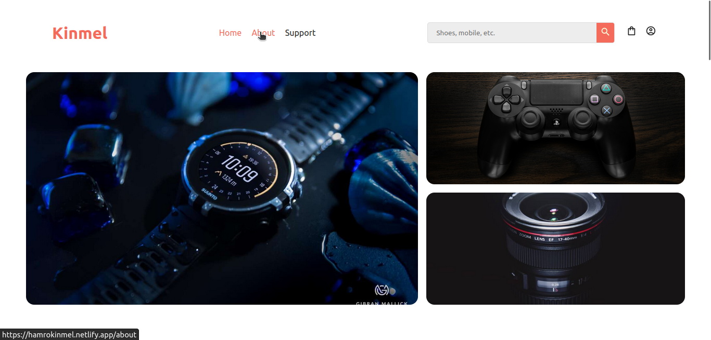
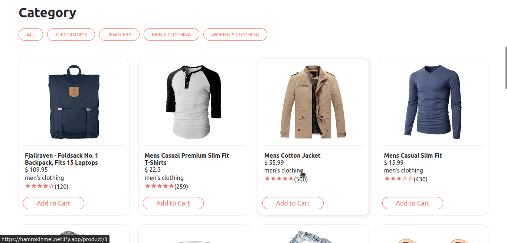
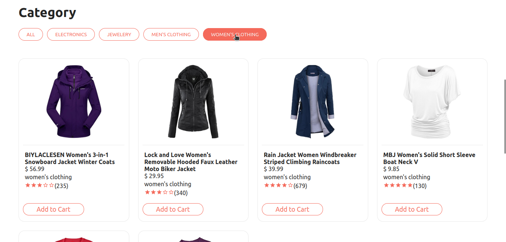
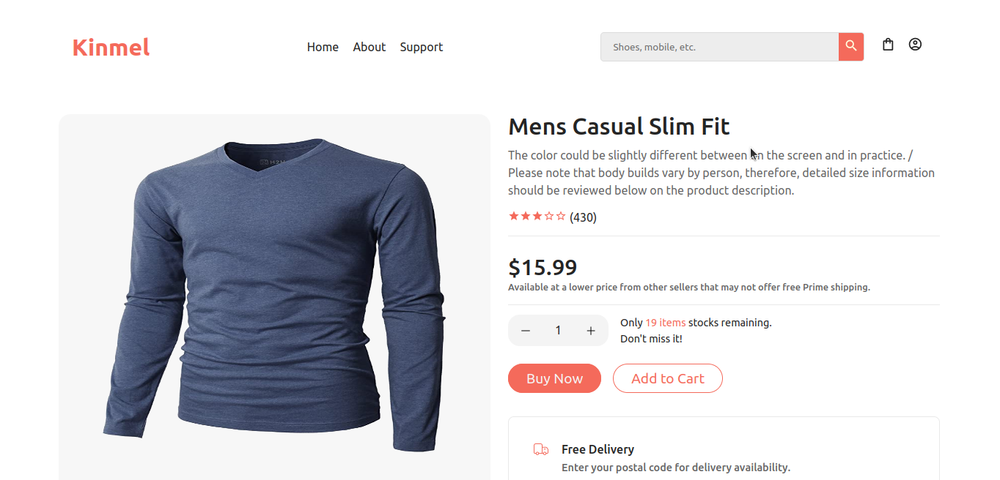
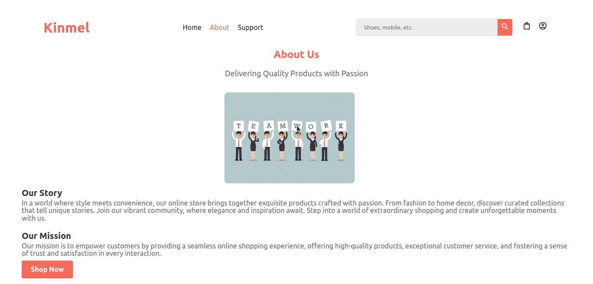
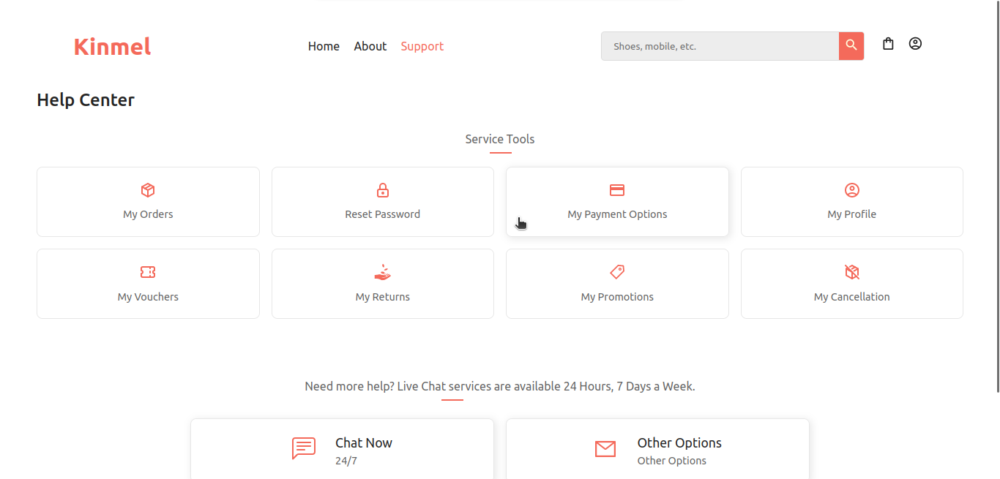
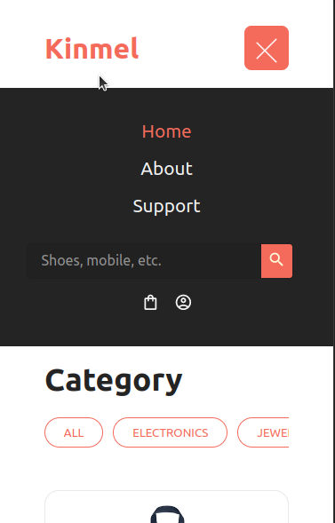
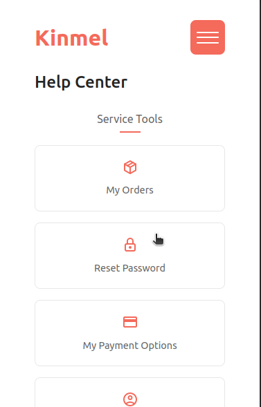

# Kinmel
> An ecommerce frontend project build with React JS And Redux.


## Table of Content 
- [General Info](#general-info)
- [Technologies](#technologies)
- [Glimpse](#glimpse)
- [How to Run](#how-to-run)
    - [Live Demo](#live-demo)
    - [Run Locally](#run-locally)
- [Features](#features)
- [Other Details](#other-details)

## General Info
Our ecommerce website project is a comprehensive platform that enables users to browse, filter, and purchase a wide range of products. With a user-friendly interface, customers can easily navigate through categories, and access detailed product information. The website offers robust filtering options, allowing users to refine their search based on various criteria. Additionally, we provide exceptional customer service, ensuring prompt assistance and addressing any queries or concerns. Each product has a dedicated details page, offering comprehensive descriptions, images, and customer reviews. Our goal is to deliver a seamless and satisfying online shopping experience for customers.


## Technologies
The ecommerce website utilizes a range of modern technologies to provide an efficient and interactive shopping experience. JavaScript and CSS are used for dynamic and visually appealing web design. React and React Redux framework enable seamless UI rendering and state management. The integration with the Fake Shop API allows for realistic product data and inventory management. These technologies collectively enhance the website's performance, user experience, and overall functionality.
<p>
    <a href="https://pytorch.org/" target="_blank" rel="noreferrer">
        
    </a>
    <a href="https://www.python.org" target="_blank" rel="noreferrer">
        
    </a>
    <a href="https://pytorch.org/" target="_blank" rel="noreferrer">
        
    </a>
    <a href="https://www.python.org" target="_blank" rel="noreferrer">
        
    </a><a href="https://www.python.org" target="_blank" rel="noreferrer">
        
    </a><a href="https://www.python.org" target="_blank" rel="noreferrer">
        
    </a>
</p>

## Glimpse
<p>
    
    
    
    
    
    
    
    
</p>

## How to Run
### Live Demo
Live demo at <a href="https://hamrokinmel.netlify.app" target="_blank">Kinmel</a>

### Run Locally
- Clone the reposiory in your local machine.
```bash
git clone https://github.com/Anuj-Khadka/mathify.git
```
- Open the terminal inside the project folder.
- Run the command
```bash
npm run dev
```
- Open the port in your browser `localhost:5173/` <br/>


## Features
- Product catalog with detailed information.
- Product reviews to build customer trust
- Responsive design for optimal viewing on different devices
- Customer support for assistance and queries.


## Other Details
 <p align="left">
    
    
    
</p>

